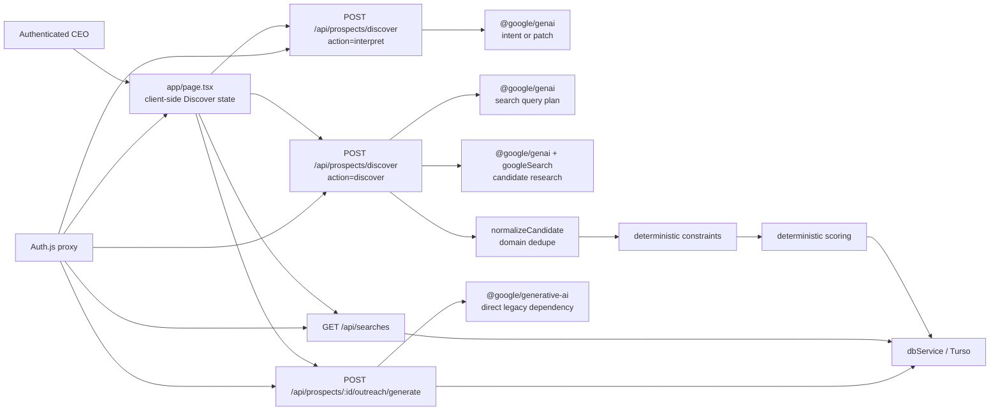
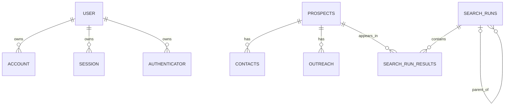
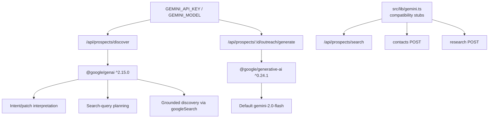

# Yorbis Intelligence Engine — Current-State Audit

Status: Pocket 1 architecture baseline  
Repository revision inspected: `f8601fb` (`main`)  
Scope: read-only audit; no application behavior, schema, authentication, or UI changes

## Executive assessment

The repository contains a working CEO-first Discover experience built around one authenticated Next.js page, Turso persistence, Gemini intent parsing, Gemini search planning, grounded company discovery, deterministic fit scoring, and search-history restore. The strongest reusable assets are the normalized discovery contract, clean NEW-search reset behavior, evidence-aware candidate normalization, deterministic score calculation, additive Turso compatibility logic, Auth.js boundary, and recent-search persistence.

The current `/api/prospects/discover` handler is also a monolith: it owns authorization, interpretation prompts, state transition semantics, planning, provider calls, normalization, source handling, constraint evaluation, scoring, persistence, and response composition. Evidence is source-linked inside model output, but the application does not independently prove that each cited source contains the claim. Prospect rows are globally upserted by domain, so restoring an older search can show a company’s latest intelligence rather than the intelligence captured at that historical run. These are the two most important architectural limitations for the Intelligence Engine.

## 1. Repository structure

```text
yorbis-sales-app/
├─ src/
│  ├─ app/
│  │  ├─ page.tsx                         # Current CEO Discover client
│  │  ├─ page.module.css / globals.css
│  │  ├─ login/*                          # Email-link sign-in UI
│  │  └─ api/
│  │     ├─ auth/[...nextauth]/route.ts   # Auth.js handler + schema guard
│  │     ├─ prospects/discover/route.ts   # Current production discovery flow
│  │     ├─ prospects/search/route.ts     # Legacy inert search route
│  │     ├─ prospects/*                   # Prospect CRUD/stage routes
│  │     ├─ prospects/[id]/contacts/*     # Legacy contact discovery
│  │     ├─ prospects/[id]/research/*     # Legacy research compatibility
│  │     ├─ prospects/[id]/outreach/*     # Outreach CRUD + generation
│  │     └─ searches/route.ts             # Recent search and restore
│  ├─ components/ProspectingHub.tsx       # Legacy, not used by current page
│  ├─ auth.ts / proxy.ts                  # Auth.js and route protection
│  └─ lib/
│     ├─ db.ts                            # Turso client, schema bootstrap, repositories
│     ├─ discovery-contract.ts            # Intent/candidate contracts + state rules
│     ├─ discovery-constraints.ts         # Deterministic request-fit checks
│     ├─ discovery-response.ts            # JSON extraction + safe errors
│     ├─ prospect-scoring.ts              # Deterministic score
│     ├─ gemini.ts                        # Legacy compatibility stubs
│     └─ auth-*.ts                        # Drizzle adapter and auth migrations
├─ scripts/
│  ├─ migrate-auth.ts
│  ├─ migrate-prospect-search.mjs
│  ├─ test-discovery.ts
│  ├─ test-discovery-persistence.ts
│  └─ seed.ts
├─ migrate.mjs                            # Obsolete better-sqlite3 migration
└─ package.json
```

## 2. Current architecture



The application uses the default Node.js runtime. No route opts into Edge runtime. That is appropriate for Turso, Auth.js, Node crypto, and provider SDK compatibility.

## 3. Current request flow

```mermaid
sequenceDiagram
    actor U as CEO
    participant UI as page.tsx
    participant API as /api/prospects/discover
    participant G as Gemini
    participant V as Validators/Scorer
    participant T as Turso

    U->>UI: Enter natural-language request
    UI->>UI: determineDiscoveryMode(query, hasSession)
    alt NEW
        UI->>UI: Clear active intent/session/results
    end
    UI->>API: interpret(mode, query, previousIntent?)
    API->>G: Parse clean intent or explicit patch
    G-->>API: JSON
    API->>API: Normalize; deterministic patch merge
    API-->>UI: Reviewable intent
    U->>UI: Confirm discovery
    UI->>API: discover(mode, intent, session, exclusions)
    API->>T: Schema preflight
    API->>G: Generate targeted search queries
    API->>G: Grounded candidate discovery
    G-->>API: Companies, sources, signals, contacts
    API->>V: Normalize, dedupe, constraints, score
    loop each accepted candidate
        API->>T: Upsert prospect by domain
    end
    API->>T: Create search run and result links
    API-->>UI: Ranked prospects
```

Failure behavior is all-or-error at the HTTP level, but persistence is not atomic. Candidate rows may already be saved if a later prospect or search-history write fails. There is no durable run-stage checkpoint or resumable partial-result protocol.

## 4. Database schema and dependency map

The runtime schema is defined imperatively in `src/lib/db.ts`; separate scripts partially duplicate it. Production was previously confirmed to contain the sales tables, and the runtime now also creates search and Auth.js structures.

| Table | Current owner/use | Key dependencies | Audit note |
|---|---|---|---|
| `prospects` | `dbService`; Discover; dashboard | Referenced by contacts, outreach, run results | Broad denormalized record; JSON evidence/signals; upserted by domain |
| `contacts` | Contact routes/repository | FK to prospects | Separate records duplicate embedded prospect contact fields |
| `outreach` | Outreach routes/repository | FK to prospects | Stores drafts/status; no claim/evidence linkage |
| `settings` | Existing production data | No active repository usage found | Preserve; ownership is currently unclear |
| `saved_searches` | Runtime schema only | User email | No active read/write path found |
| `search_runs` | Discover and `/api/searches` | User email, parent/session IDs | Stores normalized intent and lifecycle type |
| `search_run_results` | Search restore | FK to run and prospect | Links runs to mutable prospect rows; not a snapshot |
| `user` | Auth.js Drizzle adapter | Parent of account/session/authenticator | Protected authentication structure |
| `account` | Auth.js | FK to user | Required adapter table |
| `session` | Auth.js database sessions | FK to user | Required adapter table |
| `verificationToken` | Auth.js magic links | Identifier/token PK | Required adapter table |
| `authenticator` | Auth.js adapter compatibility | FK to user | Required adapter table |



### Schema-management observations

- `ensureSchema()` runs additive DDL on application access and caches its promise per server instance.
- `scripts/migrate-prospect-search.mjs` duplicates prospect/search DDL.
- Auth tables exist in both `ensureSchema()` and the dedicated `auth-migration.ts`.
- `migrate.mjs` uses `better-sqlite3`, which is not declared in `package.json`, targets a local file, and represents an obsolete schema.
- No migration ledger/version table exists for sales/discovery schema.
- JSON columns make the current model deployable but prevent referential integrity between claims, sources, signals, scores, and decisions.

## 5. Gemini dependency map



### Model configuration

- Production discovery default: `gemini-3.1-flash-lite`.
- A configured `GEMINI_MODEL` is used unless it starts with `gemini-2.0`, in which case discovery forces the newer default.
- Outreach uses a different SDK and defaults directly to stale `gemini-2.0-flash`.
- There is no provider interface, capability declaration, prompt registry, model policy, retry policy, or per-operation configuration.

### Grounding boundary

The current route records grounding metadata counts, but normalized sources come from the model’s JSON. A VERIFIED signal is downgraded only when its `sourceIds` do not match a model-returned source. The app does not currently:

- reconcile model sources with SDK `groundingChunks`;
- retrieve and fingerprint source content;
- validate that a source supports the exact claim;
- represent conflicting sources;
- retain source-access failures;
- distinguish rejected claims from rejected companies.

## 6. Search state handling

The active search state is held only in React state in `page.tsx`: query, intent, request type, discovery mode, run ID, session ID, results, phase, selected prospect, and draft state. No Redux/Zustand store, URL state, `localStorage`, `sessionStorage`, or IndexedDB is used.

Current discovery modes are `new`, `refine`, `expand`, `exclude`, `reprioritize`, and `restore`. The required lifecycle modes NEW, REFINE, EXPAND, EXCLUDE, and RESTORE are therefore present; reprioritize is an additional compatibility behavior.

Strong behavior:

- NEW clears intent, session, run, results, selection, and outreach draft state.
- Non-NEW interpretation returns a patch, which application code merges deterministically.
- RESTORE is explicit through `/api/searches?id=...`.
- Historical prospects are not used as a fallback for empty active results.

Limitations:

- Mode selection is a client-side regular-expression heuristic; the server trusts the supplied mode.
- Active intent is supplied by the client rather than loaded from the authoritative session/run.
- Session state is not URL-addressable and disappears on refresh unless restored from history.
- `requestType` and `mode` overlap as two vocabularies.
- `priorityMarkets` exists in the shared contract but not the page-local `Intent` type.

## 7. Current business models

### Prospect

`Prospect` combines company identity, company attributes, one embedded contact, evidence JSON, signals JSON, unknown signals, timing signals, score and score breakdown, recommendation text, workflow stage, research state, notes, and latest search-run ID. This makes the UI simple but conflates candidate, canonical company, intelligence snapshot, opportunity, and CRM state.

### Contact

The `contacts` table supports multiple contacts with source URL and verification status, but production discovery writes the best contact into the prospect row. The legacy contact-discovery endpoint calls a stub that always returns an empty list.

### Outreach

The `outreach` table stores subject/body/channel/status. Current generation uses prospect evidence as prompt context, saves a draft, and requires the UI user to decide what to do next. There is no explicit link from generated statements to company claims or source IDs.

### Dashboard

`page.tsx` is the current application. It presents natural-language discovery, interpretation review, ranked results, Recommended/All/Needs Review views, evidence details, decision-maker context, search history, and outreach generation. `ProspectingHub.tsx` is an unused legacy dashboard.

## 8. Authentication dependencies

- Auth.js v5 beta with the Drizzle adapter and database sessions.
- Resend email-link provider.
- Explicit allowlist: `sun@yorbisapp.com`, `anant@yorbisapp.com`.
- `src/proxy.ts` protects every path except Auth.js, login, Next.js assets, and favicon.
- Discover and search-history routes also call `auth()` directly; many other internal API handlers rely only on the proxy.
- Auth migrations are additive and verified separately.

Future Intelligence Engine work must not modify Auth.js tables, adapter configuration, session strategy, email provider, allowlist, login routes, or proxy behavior. New APIs should still perform route-level authorization for defense in depth.

## 9. Validation and error handling

Reusable patterns:

- `normalizeIntent`, `normalizePatch`, and `normalizeCandidate`.
- Safe HTTP/HTTPS URL validation.
- Unverified emails are discarded.
- VERIFIED signals without a valid source ID are downgraded to UNKNOWN.
- `DiscoveryError` provides stable error codes and safe user messages.
- Request IDs and structured lifecycle logs support incident correlation.
- Constraint checks and scoring are deterministic.

Gaps:

- AI JSON is parsed manually; no schema validator enforces the complete response.
- `normalizePatch` accepts arbitrary array-map keys at runtime.
- Source truth is not independently checked.
- Verification supports only VERIFIED/INFERRED/UNKNOWN, not CONFLICTING/REJECTED.
- Several legacy routes use `any`, expose raw error messages, or lack route-level auth.
- No centralized error taxonomy exists outside discovery.
- No transaction or idempotency key protects multi-write discovery.

## 10. Tests

Existing automated tests:

- `scripts/test-discovery.ts`: intent normalization, source-ID downgrade, URL/email safety, JSON extraction, scoring determinism, NEW-state isolation, patch semantics, mode detection, and basic constraint outcomes.
- `scripts/test-discovery-persistence.ts`: additive legacy prospect migration, data preservation, required columns, unique domain index, and prospect persistence.
- `scripts/migrate-auth.ts`: executable production migration verification for Auth.js adapter lifecycle.

Missing coverage:

- Route-handler integration tests.
- Provider contract tests and mocked Gemini responses.
- Grounding-metadata/source reconciliation tests.
- Search-session lifecycle and restore snapshot tests.
- Partial failure/idempotency/transaction tests.
- Conflict and rejection verification tests.
- Outreach claim-to-source tests.
- Authenticated browser end-to-end tests.
- Load, timeout, retry, and concurrency tests.

Repository-wide ESLint has known failures in legacy routes and `ProspectingHub.tsx`; changed production Discover files were previously validated independently.

## 11. Legacy and duplicated logic

| Component | Classification | Recommendation |
|---|---|---|
| `src/components/ProspectingHub.tsx` | Superseded UI; sends incompatible payload to current Discover route | Deprecate after confirming no imports |
| `src/app/api/prospects/search/route.ts` | Inert legacy API; imports unused DB service | Deprecate, then remove after telemetry period |
| `src/lib/gemini.ts` | Compatibility stubs returning empty/placeholder results | Wrap behind future provider interface, then remove |
| Contact discovery POST | Calls inert stub | Replace in decision-maker pocket |
| Research POST | Saves placeholder compatibility text | Replace with claim/source pipeline |
| `@google/generative-ai` | Second, older SDK used by outreach | Replace through provider abstraction |
| `gemini-2.0-flash` outreach default | Stale model setting | Remove only when outreach moves to provider abstraction |
| `migrate.mjs` | Obsolete local schema and undeclared dependency | Mark retired; remove in a future cleanup pocket |
| Auth schema inside `db.ts` plus `auth-migration.ts` | Duplicated DDL ownership | Keep behavior now; later make dedicated auth migration canonical |
| Page-local `Prospect`/`Intent` types | Duplicate domain shapes | Replace with shared read models in a future pocket |

## 12. Production risks

### Critical

1. **Tracked credential artifacts:** `Auth - secret.txt` and `Turbo Token.txt` are tracked by Git. Local database files are also tracked. Their contents were not read during this audit. Treat these as potentially compromised: rotate the credentials, purge them from repository history, and invalidate old tokens through a separately approved security operation.
2. **Evidence is not independently validated:** a model can return a plausible URL and source ID that passes current normalization without proving claim support.

### High

3. **Historical search drift:** `search_run_results` references a mutable prospect row. A later domain upsert can change what an older run displays.
4. **Non-atomic discovery writes:** prospect upserts occur before the search run and links. A failure can leave partial/orphaned results.
5. **Runtime DDL:** every server instance may attempt schema setup; migration ownership is split across runtime and scripts.
6. **Direct provider coupling:** provider/model/prompt logic is embedded in route handlers, and outreach uses a second SDK/model policy.

### Medium

7. **Raw query logging:** the first 300 characters of CEO search text are logged; searches could contain sensitive customer strategy.
8. **Client-authoritative state:** mode, intent, and session lineage can be manipulated or become inconsistent.
9. **Broad prospect deletion endpoint:** `DELETE /api/prospects` clears all prospects. It is proxy-protected but has no additional role/confirmation contract.
10. **Constraint heuristics:** substring geography/type checks can create false failures; unknown values do not have source provenance.
11. **No durable learning model:** sales outcomes and user corrections are not captured as structured feedback.

## 13. Reusable components

- Auth.js configuration, protected route boundary, and approved-user allowlist.
- Turso client factory and parameterized query style.
- Existing `prospects`, `contacts`, `outreach`, `search_runs`, and `search_run_results` as compatibility data.
- `DiscoveryIntent` reset/patch semantics.
- Explicit NEW/REFINE/EXPAND/EXCLUDE/RESTORE lifecycle.
- Safe URL and verified-email normalization principles.
- JSON extraction as a fallback parser, behind future schema validation.
- Structured request IDs and stage logging.
- Deterministic constraint and scoring pattern.
- CEO-first Discover page and recent-search restore workflow.
- Human-review-first outreach draft behavior.

## 14. Components to wrap or replace later

### Wrap first

- `GoogleGenAI` behind an `AIProvider` capability interface.
- `dbService` behind module-owned repositories.
- `/api/prospects/discover` behind a discovery application service/orchestrator.
- Existing prospect row behind a legacy projection/compatibility repository.
- Existing score function behind a versioned scoring policy.

### Replace after compatibility is established

- Model-returned source arrays with validated, canonical `CompanySource` records.
- JSON claim/signal blobs with normalized source-backed records.
- Mutable search-run result links with immutable result snapshots.
- Embedded single contact fields with decision-maker intelligence records.
- Direct outreach SDK and prompt with evidence-aware outreach recommendations.
- Legacy search, research, contact, and `ProspectingHub` paths.

## Audit conclusion

The current product should remain operational while the Intelligence Engine is introduced as a modular layer beside it. The correct seam is not a UI rewrite or a new all-in-one route. It is a versioned domain/application layer that makes source validation, company identity, claims, verification, scoring, and search-session snapshots authoritative, while continuing to project compatible prospect records for the existing page.
