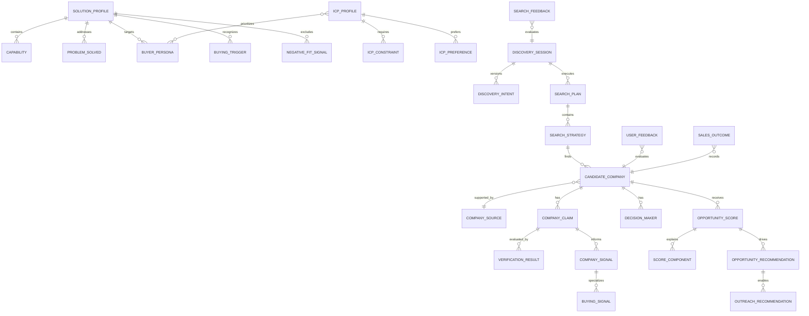

# Yorbis Intelligence Engine — Proposed Domain Model

Status: conceptual business model; no TypeScript interfaces or database tables created

## Conventions

- IDs are opaque text identifiers.
- Every mutable definition has `version`, `status`, `createdAt`, `updatedAt`, and actor provenance.
- AI-generated data records provider/model/prompt version and remains a proposal until deterministic validation.
- Evidence states are `VERIFIED`, `INFERRED`, `UNKNOWN`, `CONFLICTING`, and `REJECTED`.
- Search modes are `NEW`, `REFINE`, `EXPAND`, `EXCLUDE`, and `RESTORE`.
- Claims and opportunity results are temporal snapshots; they are not silently overwritten.

## Relationship overview

## A. Solution Knowledge Base

### SolutionProfile

| Attribute | Definition |
|---|---|
| Purpose | Versioned description of a Yorbis commercial solution or plan used to ground ICPs, scoring, recommendations, and outreach. |
| Key fields | `id`, `name`, `description`, `positioning`, `planName`, `commercialSummary`, `version`, `status`, effective dates |
| Relationships | Has capabilities, problems solved, personas, triggers, and negative-fit signals; referenced by ICP profiles and recommendations |
| Lifecycle | DRAFT → ACTIVE → RETIRED; active versions are immutable |
| Owning module | Solution Knowledge |
| AI population | AI may draft descriptions from approved material; human approval required |
| Deterministic validation | Required: unique active version, required fields, valid relationships/effective dates |

### Capability

| Attribute | Definition |
|---|---|
| Purpose | Atomic, supportable Yorbis capability such as card pay-in, global fiat payout, or stablecoin settlement. |
| Key fields | `id`, `solutionProfileId`, `name`, `description`, `availability`, supported regions/rails, evidence/reference |
| Relationships | Belongs to SolutionProfile; connects to problems and recommendations |
| Lifecycle | DRAFT → ACTIVE → RETIRED |
| Owning module | Solution Knowledge |
| AI population | May propose normalized wording, never availability facts without approval |
| Deterministic validation | Required for availability enums, region formats, and active parent |

### ProblemSolved

| Attribute | Definition |
|---|---|
| Purpose | Customer business problem that a capability legitimately addresses. |
| Key fields | `id`, `solutionProfileId`, `name`, `description`, `severityContext`, `capabilityIds` |
| Relationships | Belongs to solution; referenced by ICPs, triggers, recommendations, outreach |
| Lifecycle | DRAFT → ACTIVE → RETIRED |
| Owning module | Solution Knowledge |
| AI population | May draft from approved product knowledge |
| Deterministic validation | Required relationship and version checks |

### BuyerPersona

| Attribute | Definition |
|---|---|
| Purpose | Defines an appropriate role/seniority and its likely responsibilities, not a specific person. |
| Key fields | `id`, `solutionProfileId`, `name`, role titles, seniority, company-size applicability, responsibilities, priority |
| Relationships | Used by ICPProfile and DecisionMaker matching |
| Lifecycle | DRAFT → ACTIVE → RETIRED |
| Owning module | Solution Knowledge |
| AI population | May suggest title synonyms |
| Deterministic validation | Required title normalization, priority bounds, parent/version checks |

### BuyingTrigger

| Attribute | Definition |
|---|---|
| Purpose | A source-verifiable event or condition that increases timing relevance. |
| Key fields | `id`, `solutionProfileId`, `name`, taxonomy, description, recency window, required evidence strength |
| Relationships | Template for BuyingSignal; may influence scoring policy |
| Lifecycle | DRAFT → ACTIVE → RETIRED |
| Owning module | Solution Knowledge |
| AI population | May propose trigger definitions |
| Deterministic validation | Required taxonomy, recency, and evidence rules |

### NegativeFitSignal

| Attribute | Definition |
|---|---|
| Purpose | Condition indicating a company should be penalized or rejected for a solution. |
| Key fields | `id`, `solutionProfileId`, `name`, description, severity (`penalty`/`reject`), evidence requirement |
| Relationships | Referenced by ICP constraints and scoring |
| Lifecycle | DRAFT → ACTIVE → RETIRED |
| Owning module | Solution Knowledge |
| AI population | May suggest; never activate |
| Deterministic validation | Required severity and evidence policy |

## B. ICP Library

### ICPProfile

| Attribute | Definition |
|---|---|
| Purpose | Versioned definition of one target customer segment for one or more Yorbis solutions. |
| Key fields | `id`, `name`, `description`, solution IDs, persona IDs, geography, version, status, scoringPolicyVersion |
| Relationships | Has constraints/preferences; referenced by discovery intents and scores |
| Lifecycle | DRAFT → ACTIVE → RETIRED; sessions pin one version |
| Owning module | ICP Library |
| AI population | May draft candidate ICPs |
| Deterministic validation | Required: valid active solutions/personas, version consistency |

### ICPConstraint

| Attribute | Definition |
|---|---|
| Purpose | Hard requirement or hard exclusion for ICP membership. |
| Key fields | `id`, `icpProfileId`, `field`, `operator`, typed value, polarity, unknown handling, rejection reason |
| Relationships | Belongs to ICP; produces VerificationResult for candidates |
| Lifecycle | Versioned with parent ICP |
| Owning module | ICP Library |
| AI population | AI may propose from natural language |
| Deterministic validation | Mandatory typed operator/value validation and deterministic evaluation |

### ICPPreference

| Attribute | Definition |
|---|---|
| Purpose | Soft preference that affects ranking but does not reject a candidate. |
| Key fields | `id`, `icpProfileId`, `feature`, operator/value, weight, maximum points |
| Relationships | Belongs to ICP; maps to ScoreComponent |
| Lifecycle | Versioned with parent ICP |
| Owning module | ICP Library |
| AI population | AI may propose |
| Deterministic validation | Mandatory weight bounds, type checks, total-score policy checks |

## C. Discovery

### DiscoverySession

| Attribute | Definition |
|---|---|
| Purpose | Durable container for one NEW discovery and its subsequent refinement/expansion/exclusion runs. |
| Key fields | `id`, `userId/email`, `rootIntentId`, `activeIntentId`, `status`, `createdAt`, `lastRunAt` |
| Relationships | Has versioned intents, plans, candidates, feedback; parent for immutable run snapshots |
| Lifecycle | ACTIVE → COMPLETED/ARCHIVED; RESTORE is read-only access, not mutation |
| Owning module | Discovery Intent/Orchestration |
| AI population | No |
| Deterministic validation | Mandatory ownership, mode transitions, active-intent invariant |

### DiscoveryIntent

| Attribute | Definition |
|---|---|
| Purpose | Canonical, reviewable interpretation of what companies the user wants. |
| Key fields | `id`, `sessionId`, `mode`, `parentIntentId`, hard constraints, preferences, exclusions, desired count, raw request hash, version |
| Relationships | Belongs to session; may reference ICP; drives SearchPlan |
| Lifecycle | PROPOSED → ACCEPTED → SUPERSEDED; NEW has no parent/base constraints |
| Owning module | Discovery Intent |
| AI population | AI proposes clean intent or explicit patch |
| Deterministic validation | Mandatory normalization, NEW reset, patch whitelist, ownership |

### SearchPlan

| Attribute | Definition |
|---|---|
| Purpose | Executable, versioned plan for satisfying one accepted intent. |
| Key fields | `id`, `intentId`, `status`, strategy count, provider/cost/time budgets, planner version |
| Relationships | Has SearchStrategies; produces candidates |
| Lifecycle | PROPOSED → VALIDATED → RUNNING → COMPLETED/PARTIAL/FAILED |
| Owning module | Discovery Planner |
| AI population | AI may propose |
| Deterministic validation | Mandatory coverage, dedupe, budget, allowed-provider checks |

### SearchStrategy

| Attribute | Definition |
|---|---|
| Purpose | One focused collection tactic/query with explicit goal and constraints. |
| Key fields | `id`, `planId`, `type`, query, target source class, expected signal, priority, status, cursor/checkpoint |
| Relationships | Belongs to plan; produces CandidateCompany occurrences |
| Lifecycle | PENDING → RUNNING → COMPLETED/PARTIAL/FAILED/SKIPPED |
| Owning module | Discovery Planner/Candidate Collection |
| AI population | AI may generate query and rationale |
| Deterministic validation | Required query limits, duplicates, provider compatibility, budget |

### CandidateCompany

| Attribute | Definition |
|---|---|
| Purpose | Run-scoped occurrence of a possible company before or after canonical identity resolution. |
| Key fields | `id`, `sessionId`, `strategyId`, `canonicalCompanyId?`, proposed name/domain, collection status, rejection reason, raw provider reference |
| Relationships | Has sources, claims, signals, people, scores; may map to current prospect |
| Lifecycle | COLLECTED → NORMALIZED → VERIFIED/SCORED or REJECTED |
| Owning module | Candidate Collection/Company Identity |
| AI population | AI/search provider may propose candidate fields |
| Deterministic validation | Required website/domain validity, identity rules, status transition |

## D. Evidence and verification

### CompanySource

| Attribute | Definition |
|---|---|
| Purpose | Canonical record of a public source used to support or contradict company intelligence. |
| Key fields | `id`, canonical URL, domain, title, publisher, published/accessed timestamps, source type, retrieval status, excerpt/hash, trust tier |
| Relationships | Supports candidates, claims, people, and signals |
| Lifecycle | DISCOVERED → RETRIEVED/UNAVAILABLE → VALIDATED/REJECTED; refresh creates a new observation |
| Owning module | Source Validation |
| AI population | Provider may return source metadata |
| Deterministic validation | Mandatory URL canonicalization, allow/deny policy, retrieval metadata, fingerprint |

### CompanyClaim

| Attribute | Definition |
|---|---|
| Purpose | Atomic temporal assertion about a company, such as location, size range, market, supplier activity, or business model. |
| Key fields | `id`, candidate/company ID, subject, predicate, typed value, valid time, extracted text, status, extraction provenance |
| Relationships | Linked to one or more sources and VerificationResults; inputs to signals and constraints |
| Lifecycle | PROPOSED → VERIFIED/INFERRED/UNKNOWN/CONFLICTING/REJECTED; superseded rather than overwritten |
| Owning module | Company Claims |
| AI population | AI extracts/proposes |
| Deterministic validation | Mandatory schema/type/source linkage and state transition |

### VerificationResult

| Attribute | Definition |
|---|---|
| Purpose | Auditable evaluation of a claim or constraint against evidence and policy. |
| Key fields | `id`, target type/id, state, explanation, supporting/contradicting source IDs, validator version, confidence, evaluatedAt |
| Relationships | Belongs to claim or constraint evaluation; informs scores and recommendations |
| Lifecycle | Immutable result; later evaluation creates a new version |
| Owning module | Verification |
| AI population | AI may provide semantic support assessment |
| Deterministic validation | Mandatory final state calculation, source existence, conflict rules |

### CompanySignal

| Attribute | Definition |
|---|---|
| Purpose | Structured, time-bounded business characteristic derived from verified claims. |
| Key fields | `id`, company/candidate ID, taxonomy, label, state, strength, observedAt, expiresAt, claim IDs |
| Relationships | Derived from claims; parent/general form of buying signals; scoring input |
| Lifecycle | ACTIVE → EXPIRED/SUPERSEDED/REJECTED |
| Owning module | Signals |
| AI population | AI may detect/classify |
| Deterministic validation | Required evidence threshold, taxonomy, expiry, no unsupported VERIFIED state |

### BuyingSignal

| Attribute | Definition |
|---|---|
| Purpose | Company signal specifically indicating current commercial timing. |
| Key fields | `id`, companySignalId`, buyingTriggerId, relevance, event date, recency score, reason |
| Relationships | Specializes CompanySignal; references BuyingTrigger; feeds scoring/recommendations |
| Lifecycle | ACTIVE until trigger window expires; may become CONFLICTING/REJECTED |
| Owning module | Signals |
| AI population | AI may detect and explain |
| Deterministic validation | Required dated source, trigger match, recency calculation |

### DecisionMaker

| Attribute | Definition |
|---|---|
| Purpose | Source-backed person-role recommendation for a candidate company. |
| Key fields | `id`, company/candidate ID, name, normalized title, personaId, profile URL, public email, email status, role state, source IDs, reason, lastVerifiedAt |
| Relationships | Matches BuyerPersona; supported by sources; influences recommendations |
| Lifecycle | PROPOSED → VERIFIED/INFERRED/UNKNOWN/CONFLICTING/REJECTED; expires/reverifies |
| Owning module | Decision-Maker Intelligence |
| AI population | AI may identify person and role |
| Deterministic validation | Mandatory source match; no guessed email may be VERIFIED |

## E. Scoring and action

### OpportunityScore

| Attribute | Definition |
|---|---|
| Purpose | Immutable, deterministic 0–100 ranking for one candidate against one ICP/intent and policy version. |
| Key fields | `id`, candidateId`, icpVersion, intentId, policyVersion, total, classification, rejection status, calculatedAt |
| Relationships | Has ScoreComponents; drives recommendations |
| Lifecycle | Immutable snapshot; recalculate into a new score |
| Owning module | Opportunity Scoring |
| AI population | No numerical population |
| Deterministic validation | Mandatory component sum, bounds, policy version, hard-constraint gate |

### ScoreComponent

| Attribute | Definition |
|---|---|
| Purpose | Explainable contribution or penalty in an OpportunityScore. |
| Key fields | `id`, scoreId`, feature, input value, evidence/verification IDs, weight, points, maximum, explanation |
| Relationships | Belongs to score; references verified inputs |
| Lifecycle | Immutable with score |
| Owning module | Opportunity Scoring |
| AI population | No points; AI may draft plain-language explanation from stored facts |
| Deterministic validation | Mandatory arithmetic and sourceable input |

### OpportunityRecommendation

| Attribute | Definition |
|---|---|
| Purpose | Evidence-based recommendation on whether and how to engage a company. |
| Key fields | `id`, candidateId`, scoreId, recommendation state, solutionId, problemId, summary, next action, risks/unknowns, claim IDs |
| Relationships | Uses score, knowledge base, claims, signals, and decision makers; parent of outreach |
| Lifecycle | PROPOSED → APPROVED/DISMISSED/SUPERSEDED |
| Owning module | Recommendations |
| AI population | AI may draft narrative and next action |
| Deterministic validation | Required eligibility threshold, allowed claims, active knowledge versions |

### OutreachRecommendation

| Attribute | Definition |
|---|---|
| Purpose | Human-reviewable, source-aware message or call approach for one decision maker/channel. |
| Key fields | `id`, opportunityRecommendationId`, decisionMakerId, channel, subject, body, CTA, used claim IDs, status, generation provenance |
| Relationships | Belongs to opportunity recommendation; may project to current `outreach` |
| Lifecycle | DRAFT → APPROVED → SENT/ARCHIVED; revisions create versions |
| Owning module | Outreach |
| AI population | AI drafts |
| Deterministic validation | Mandatory allowed-claim check, contact state, channel constraints, human approval |

## F. Learning and feedback

### UserFeedback

| Attribute | Definition |
|---|---|
| Purpose | Explicit user correction or assessment of a company, claim, score, person, or recommendation. |
| Key fields | `id`, userId, target type/id, feedback type, rating, correction, reason, createdAt |
| Relationships | Targets engine entities; may create evaluation examples |
| Lifecycle | SUBMITTED → REVIEWED → APPLIED/DISMISSED |
| Owning module | Learning & Feedback |
| AI population | No; AI may summarize aggregate themes |
| Deterministic validation | Required ownership, target existence, allowed feedback types |

### SearchFeedback

| Attribute | Definition |
|---|---|
| Purpose | Structured assessment of search intent, plan, result relevance, omissions, or duplicates. |
| Key fields | `id`, session/run ID, userId, metric/type, value, comment, selected/rejected candidate IDs |
| Relationships | Belongs to DiscoverySession/run; feeds planner evaluation |
| Lifecycle | SUBMITTED → AGGREGATED/REVIEWED |
| Owning module | Learning & Feedback |
| AI population | No primary population |
| Deterministic validation | Required session ownership and candidate membership |

### SalesOutcome

| Attribute | Definition |
|---|---|
| Purpose | Ground-truth commercial outcome used to evaluate discovery and recommendations. |
| Key fields | `id`, company/candidate/prospect ID, outcome type, stage, value/volume range if approved, occurredAt, source, notes |
| Relationships | Connects opportunities, outreach, and ICP/scoring versions |
| Lifecycle | RECORDED → CONFIRMED/CORRECTED; append-only history |
| Owning module | Learning & Feedback / Sales |
| AI population | No; AI may categorize notes as a proposal |
| Deterministic validation | Required outcome taxonomy, chronology, source/user provenance |

## Verification-state rules

| State | Meaning | Permitted downstream use |
|---|---|---|
| VERIFIED | Direct support from one or more valid sources with no material contradiction | Hard constraints, full scoring, outreach factual statements |
| INFERRED | Reasonable conclusion from valid evidence but not directly stated | Partial scoring if policy permits; qualified language only |
| UNKNOWN | Insufficient evidence | No positive scoring; display as uncertainty |
| CONFLICTING | Credible sources materially disagree | No positive scoring; human review; never assert in outreach |
| REJECTED | Invalid source, invalid claim, disallowed inference, or confirmed hard mismatch | Excluded from scoring/outreach; retained for audit |

## Aggregate invariants

1. A VERIFIED claim must reference at least one validated source.
2. A VERIFIED decision maker must have source-backed company-role association.
3. A public email is either explicitly sourced or absent; patterns are never presented as verified.
4. A score is reproducible from stored components and policy version.
5. An outreach draft can use only approved knowledge and VERIFIED claims, plus clearly qualified INFERRED context when policy allows.
6. A NEW intent has no inherited parent constraints, exclusions, or preferences.
7. A RESTORE operation does not create provider calls or modify the stored snapshot.
8. A candidate rejected by a hard constraint cannot receive an actionable recommendation.
