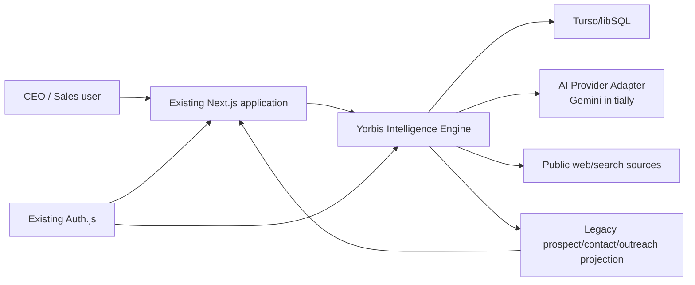
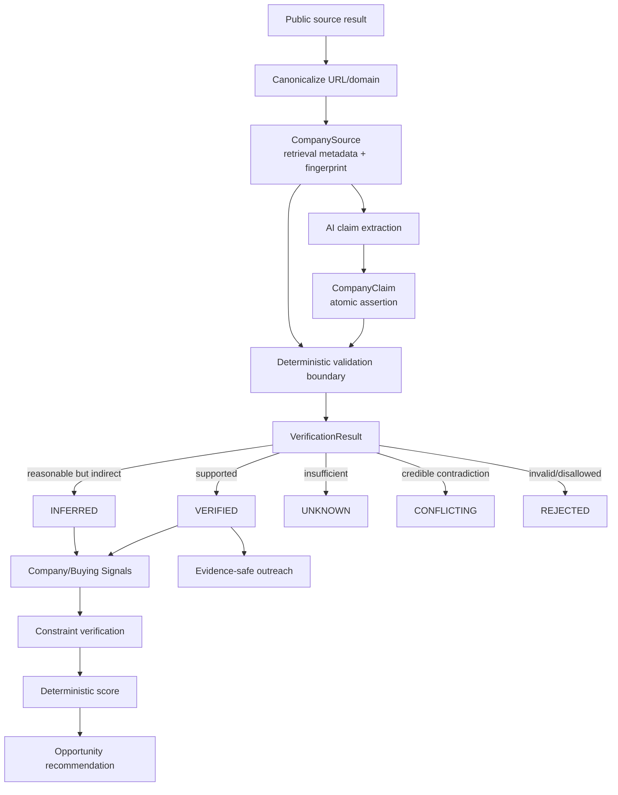
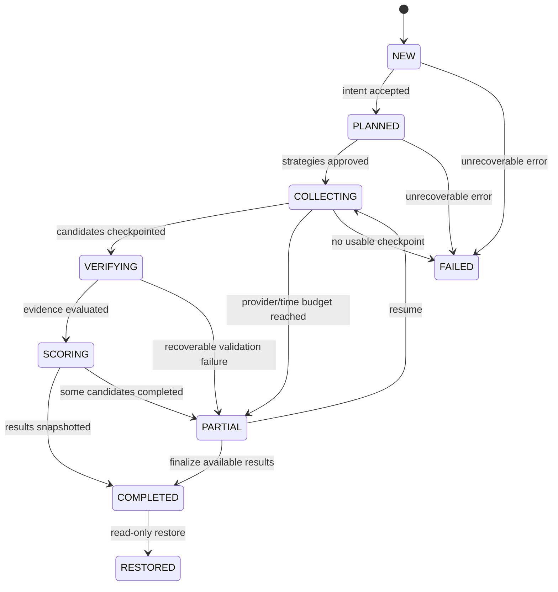
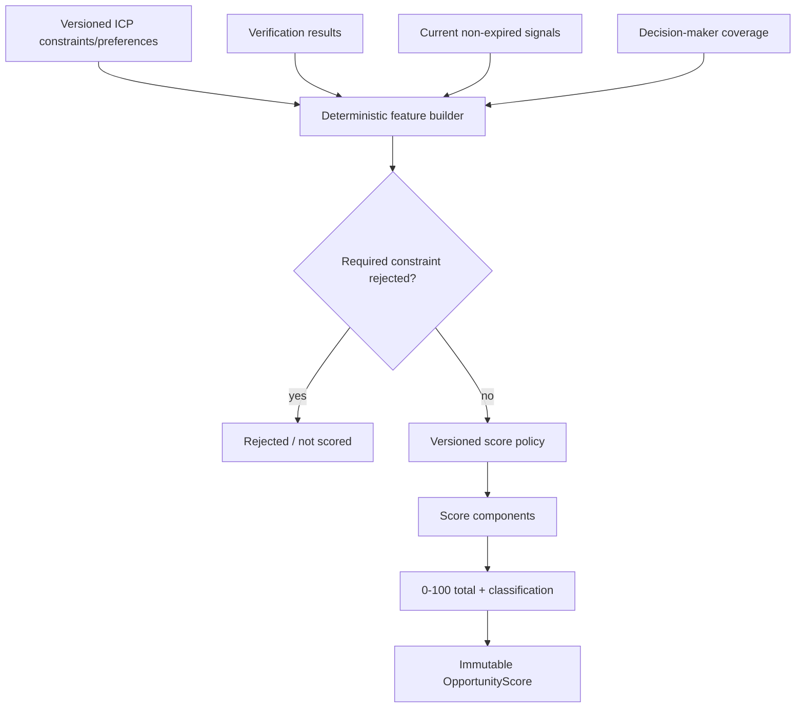

# Yorbis Intelligence Engine — Target System Architecture

Status: proposed architecture; no implementation or schema changes in Pocket 1

## Architectural principles

1. AI proposes; deterministic code validates, decides lifecycle transitions, and calculates scores.
2. No factual company claim becomes VERIFIED without a canonical source and a validation result.
3. Search sessions are durable and results are immutable snapshots.
4. NEW starts from an empty intent. Only explicit REFINE, EXPAND, or EXCLUDE operations may inherit active session state. RESTORE reads a snapshot and performs no research.
5. Partial results are visible, attributable, resumable, and never represented as a fully completed run.
6. Provider SDKs, models, prompts, and grounding capabilities are infrastructure concerns, not route-handler concerns.
7. Existing production tables and UI remain compatible during additive migration.
8. Feedback informs versioned policies; it never silently rewrites prompts, ICPs, or scoring weights.

## System context



## Module boundaries

| Module | Owns | Deterministic responsibilities | AI-assisted responsibilities |
|---|---|---|---|
| Solution Knowledge | Yorbis products, capabilities, problems, personas, triggers, negative fits | Versioning, activation, referential integrity | Drafting/summarizing approved knowledge |
| ICP Library | ICP profiles, constraints, preferences, scoring linkage | Constraint semantics, validation, versions | Suggesting candidate ICPs/preferences |
| Discovery Intent | User request and session transitions | NEW reset, patch application, mode authorization, canonical intent | Natural-language parse into intent/patch proposal |
| Discovery Planner | Search plan and strategies | Required strategy coverage, budgets, dedupe, plan state | Query and strategy proposal |
| Candidate Collection | Provider search execution, raw candidates | Provider budgets, idempotency, checkpoints | Search/grounding execution |
| Company Identity | Canonical companies and aliases | Domain normalization, identity merge rules, dedupe | Alias/identity suggestions |
| Source Validation | Sources, retrieval metadata, fingerprints | URL policy, canonicalization, trust rules, claim-source checks | Claim extraction and relevance proposal |
| Company Claims | Atomic factual assertions | Claim identity, temporal validity, status transition | Claim extraction from sources |
| Verification | Verification results and conflicts | VERIFIED/INFERRED/UNKNOWN/CONFLICTING/REJECTED rules | Semantic support/contradiction proposal |
| Signals | Company and buying signals | Signal taxonomy, recency, expiry, evidence requirements | Signal detection/classification |
| Decision Makers | People, roles, evidence, contact methods | Persona matching, email status, source requirements | Candidate identification and role reasoning |
| Opportunity Scoring | Score policy, components, score snapshot | Entire numerical score and explanation | No direct score assignment; may suggest feature inputs |
| Recommendations | Opportunity and next action | Eligibility and evidence gates | Narrative recommendation proposal |
| Outreach | Evidence-linked drafts | Allowed-claim gate, channel rules, human approval | Draft generation |
| Learning & Feedback | User feedback, search feedback, sales outcomes | Aggregation, evaluation datasets, policy approvals | Pattern analysis and proposed improvements |
| Orchestration | Run state, retries, partial results | State machine, idempotency, transaction boundaries | None |

## Logical layers and likely repository placement

```text
src/
├─ domain/yie/                 # Pure business entities, enums, policies
├─ application/yie/            # Use cases and orchestration
│  ├─ knowledge/
│  ├─ discovery/
│  ├─ verification/
│  ├─ scoring/
│  ├─ recommendations/
│  └─ feedback/
├─ infrastructure/yie/
│  ├─ ai/                     # AIProvider + Gemini adapter
│  ├─ search/                 # Search/grounding adapters
│  └─ persistence/            # Turso repositories
├─ app/api/yie/               # Thin authenticated HTTP adapters
└─ lib/                       # Existing compatibility layer during migration
```

Route handlers remain thin HTTP adapters. Long-running business steps live in application services, not in `route.ts`. The existing route can initially call the orchestrator and translate its result into the current response shape.

## End-to-end evidence flow



The source-validation boundary is mandatory. AI output before that boundary is untrusted proposal data. A source-linked claim after validation has:

- canonical source identity and URL;
- retrieval/access timestamp and status;
- source fingerprint or immutable excerpt hash where permitted;
- exact claim text and subject/predicate/value;
- support/contradiction result;
- verification state and reason;
- validator/policy version.

## Discovery-session lifecycle



User operation semantics:

| Mode | Base intent | Result behavior | Session relationship |
|---|---|---|---|
| NEW | Empty intent | New result set | New session |
| REFINE | Active session intent + explicit patch | Recompute against refined criteria | Child run in same session |
| EXPAND | Active intent | Add novel candidates; exclude existing identities | Child run in same session |
| EXCLUDE | Active intent + explicit negative patch | Recompute/filter and continue | Child run in same session |
| RESTORE | Stored run snapshot | No provider calls, no mutation | Read-only view |

The existing REPRIORITIZE behavior should be represented as a REFINE operation that changes preferences, not as a separate persistence lifecycle.

## Discovery pipeline

```mermaid
flowchart LR
    Request["Authenticated command"] --> State["Load authoritative session"]
    State --> Intent["Parse proposal + deterministic apply"]
    Intent --> Plan["Plan strategies"]
    Plan --> Collect["Collect candidates"]
    Collect --> Normalize["Normalize identity"]
    Normalize --> Dedupe["Dedupe/merge aliases"]
    Dedupe --> Sources["Validate sources"]
    Sources --> Claims["Extract atomic claims"]
    Claims --> Verify["Verify claims/constraints"]
    Verify --> People["Decision makers"]
    Verify --> Signals["Buying signals"]
    People --> Score["Deterministic score"]
    Signals --> Score
    Score --> Recommend["Recommendations"]
    Recommend --> Snapshot["Immutable result snapshot"]
    Snapshot --> Project["Legacy prospect projection"]
```



Each stage accepts and returns a versioned contract. The orchestrator records stage start/completion, counts, policy versions, provider operation IDs, and recoverable errors.

## Deterministic versus AI-assisted boundary

AI may:

- parse natural language into a proposed intent or patch;
- suggest search strategies and queries;
- execute provider-supported grounded search;
- extract candidate names, claims, people, and signals;
- assess semantic support as one input to verification;
- draft summaries, recommendations, and outreach.

AI may not:

- choose whether a NEW search inherits prior filters;
- mutate an authoritative intent directly;
- establish canonical company identity without deterministic checks;
- mark unsupported output VERIFIED;
- calculate or override the numerical opportunity score;
- approve outreach or sales actions;
- modify ICP/scoring policy based on outcomes without review.

## Database ownership

Each module owns writes to its future normalized tables through a repository interface. Other modules use application services or read models, not ad hoc SQL.

- Knowledge module: solution, capability, persona, trigger, ICP records.
- Discovery module: session, intent, plan, strategy, stage/checkpoint records.
- Company module: canonical company, aliases, candidate occurrence.
- Evidence module: source, claim, claim-source association, verification.
- Intelligence module: signals, decision makers, scores, recommendations.
- Engagement module: outreach recommendations and feedback/outcomes.
- Compatibility module: projections into current `prospects`, `contacts`, `outreach`, and search history.

Auth.js retains exclusive ownership of `user`, `account`, `session`, `verificationToken`, and `authenticator`.

## Scoring flow



Every score stores the policy version, input feature values, component weights, component points, total, classification, and calculation timestamp. A model never emits the score.

## Partial-result behavior

- A run moves to PARTIAL when at least one candidate checkpoint exists and a recoverable stage fails or hits a time/provider budget.
- Completed candidates are persisted as run-scoped snapshots and may be displayed with a “partial” banner.
- Pending candidates retain the last completed stage and retry count.
- Resume uses the same idempotency key and skips completed stages.
- No result is marked COMPLETED until its source, verification, score, and snapshot writes succeed.
- A failed compatibility projection does not invalidate canonical Intelligence Engine data; it is retried independently.
- Empty valid results are COMPLETED with zero results, not treated as a provider failure.

## Error handling and observability

Define a cross-module error envelope:

- `requestId`, `sessionId`, `runId`, `stage`;
- stable public code and safe message;
- retryability and recommended action;
- provider operation/model metadata without prompt or secret leakage;
- partial-result availability;
- internal cause retained only in server logs.

Error classes should distinguish validation, authorization, provider quota, provider timeout, malformed provider response, source access, verification conflict, persistence, and invariant violations.

Logs should avoid raw search text and emails. Use an intent hash, authenticated user hash, run IDs, counts, durations, model/provider identifiers, token/cost metadata when available, and policy versions.

## Relationship to the existing application

### Initial compatibility

1. Keep current Auth.js and CEO page unchanged.
2. Add the engine behind internal interfaces.
3. Adapt the current Discover route to call the engine.
4. Project engine outputs into the existing `Prospect` response.
5. Continue writing legacy records while the new read path is validated.
6. Move restore to immutable engine snapshots, with fallback to current search history.

### End state

The existing page consumes a purpose-built read model:

- ranked opportunity;
- canonical company summary;
- verified/inferred/unknown/conflicting findings;
- constraint result;
- decision-maker recommendation;
- evidence links;
- deterministic score explanation;
- outreach recommendation.

No UI redesign is required to adopt the engine.

## Key architectural decisions requiring approval

1. Whether source content may be stored, or only URL, metadata, extracted excerpt, and hash.
2. Whether discovery execution remains synchronous under the Vercel function limit or adopts a durable job runner in a later pocket.
3. How long immutable source/claim/result snapshots are retained.
4. Whether a company can be merged automatically by canonical domain or requires human review for ambiguous identities.
5. Whether inferred claims may contribute partial scoring points and, if so, at what policy weight.
6. Whether REPRIORITIZE remains a public mode or becomes a REFINE preference patch.
